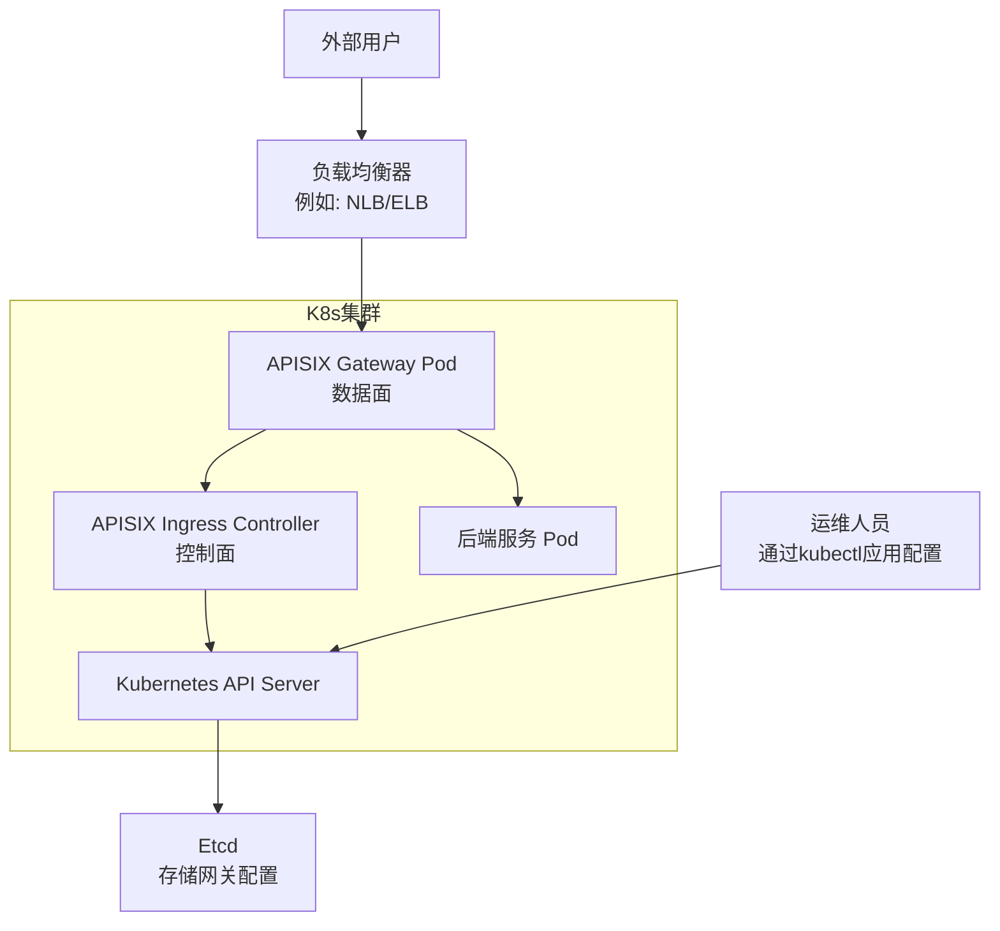

# 安装
```
helm install xcoding-test helm/xcoding --namespace xcoding --create-namespace
```
# 升级
```
helm upgrade xcoding-test helm/xcoding --namespace xcoding
```
# 访问流程

```mermaid
flowchart TD
    A[外部用户] --> B[负载均衡器<br/>例如: NLB/ELB]
    B --> C[APISIX Gateway Pod<br/>数据面]
    C --> D[APISIX Ingress Controller<br/>控制面]
    D --> E[Kubernetes API Server]
    E --> F[Etcd<br/>存储网关配置]
    C --> G[后端服务 Pod]
    
    H[运维人员<br/>通过kubectl应用配置] --> E
    
    subgraph K8s集群
        C
        D
        E
        G
    end
```